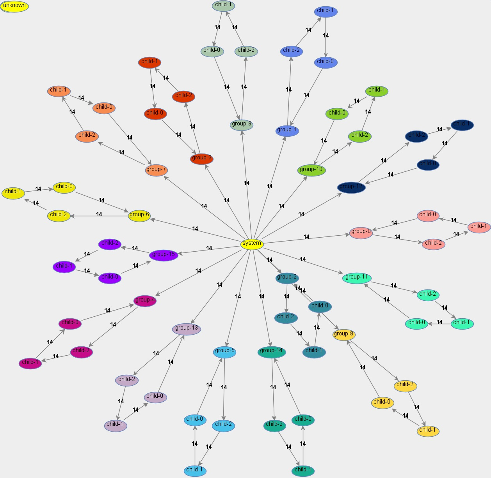
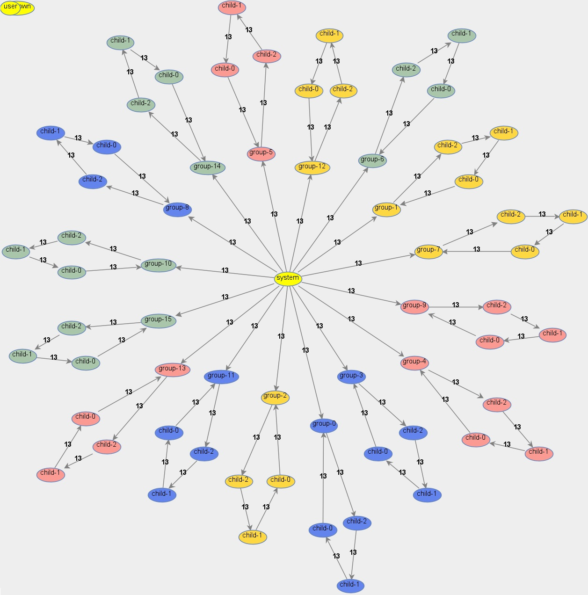

## Actor4j Analyzer ##

This is the repository for Actor4j analyzer.

>Aim of this project was to enhance the performance in message passing. As a reference implementation `Akka` was used. Results of the research shown that intra-thread-communication is much better than inter-thread-communication. You can group actors, so they are bound to the same thread, for instance. Message queues of the actors are outsourced to the thread. The four principles of reactive manifesto and the four semantic properties of actor systems have been applied.

For further information on `Actor4j`, see the following more complete [documentation](https://github.com/relvaner/actor4j-core).

### Colorized actors linked to threads ###

In this example, 16 ring group structures were distributed equally across 16 threads. The ring group members are always belonging to the same thread. The master node of every ring group extends the class `ActorWithBothGroups` (implements `ActorDistributedGroupMember` and `ActorGroupMember`). All other members of the ring group extends the class `ActorWithGroup` (implements `ActorGroupMember`). 

Fig. 1: Representation of 16 ring structures with 16 threads

In this example, 16 ring group structures were distributed equally across four threads. This results in four by four ring groups of the same color, that are belonging to the same thread

Fig. 2: Representation of 16 ring structures with 4 threads

Page to be updated 09/21/2020

