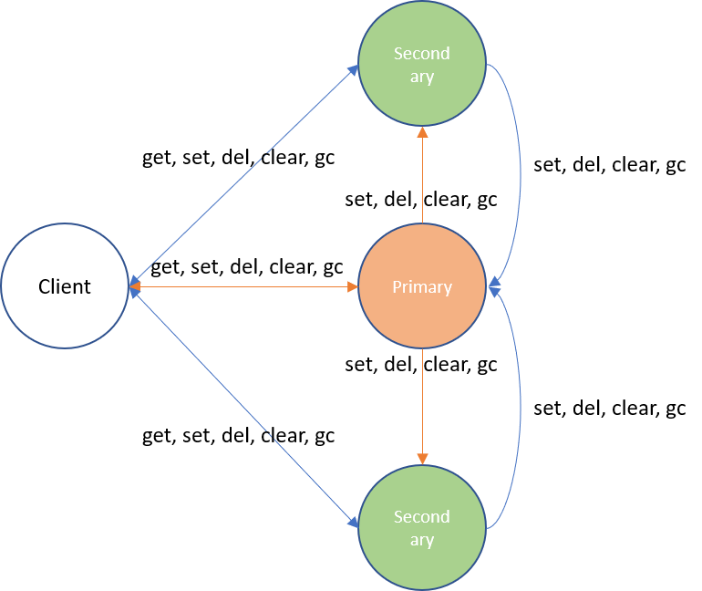
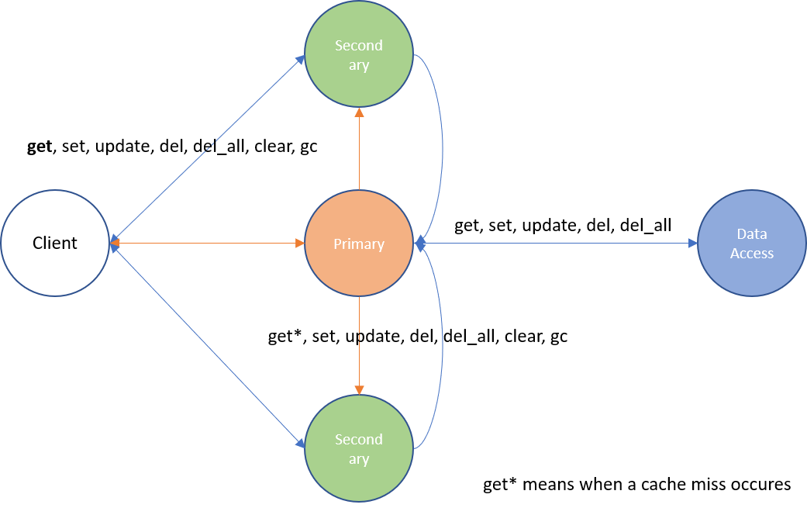
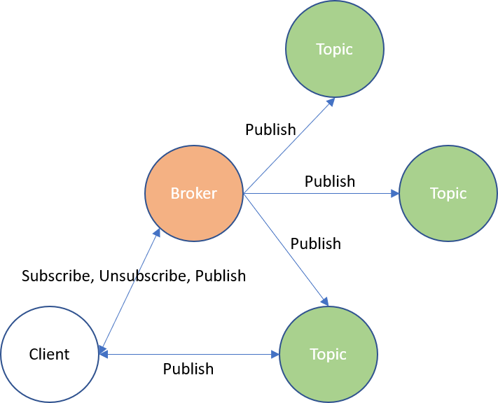

## Actor4j Data ##

This is the repository for Actor4j data.

>Aim of this project was to enhance the performance in message passing. As a reference implementation `Akka` was used. Results of the research shown that intra-thread-communication is much better than inter-thread-communication. You can group actors, so they are bound to the same thread, for instance. Message queues of the actors are outsourced to the thread. The four principles of reactive manifesto and the four semantic properties of actor systems have been applied.

For further information on `Actor4j`, see the following more complete [documentation](https://github.com/relvaner/actor4j-core).

### Caching ###

`Actor4j` also supports caching, once volatile (see Figure 1) and persistent caching (see Figure 2). With persistent caching, the data is also stored in a database. A distinction is made between primary and secondaries, i.e. corresponding cache replicas can be created. Single leader replication [[1](#1)] is currently used. All data changes initially go via the primary ("sequential consistency" [[2](#2)].). Requested data change requests to secondaries are forwarded to the primary. The primary makes the data change and sends a notification of the data change to all secondaries. Read requests can be accepted by all replicas (primary, secondaries). By guaranteeing sequential consistency, atomic operations such as Compare And Set (CAS) are also possible. With persistent caching, data changes are also passed to the database (via `DataAccessActor`). Partitioning can be implemented by using several primary replicas (partitions) using range or hash partitioning [[1](#1)].


Fig. 1: Volatile Caching in `Actor4j`


Fig. 2: Persistent Caching in `Actor4j`

#### Example with Volatile/Persistent Caching ####

The next two source code examples are showing the usage of volatile or persistent caching. A manager actor is created that builds up a cache on creation-time, some key-value pairs are generated. At persistent caching there must be first created a DataAccessActor, that is responsible for persisting the data. Currently there can be used a `MongoDataAccessActor` or an `IMDBDataAccessActor`. Afterwards a client makes a request to a key and receives later asynchronously the corresponding key-value pair.

```java
/* Example with Volatile Caching */
system.addActor(() -> new Actor("manager") {
	protected VolatileActorCacheManager<String, String> manager;
	@Override 
	public void preStart() {
		manager = new VolatileActorCacheManager<String, String>(this, "cache");
		addChild(manager.create(INSTANCES, 500));
				
		manager.set("key1", "value1");
		manager.set("key2", "value2");
		manager.set("key3", "value3");
	}
			
	@Override
	public void receive(ActorMessage<?> message) {
		// empty
	}
});
…
system.addActor(() -> new Actor("client") {
	protected VolatileActorCacheManager<String, String> manager;
	@Override 
	public void preStart() {
		manager = new VolatileActorCacheManager<String, String>(this, "cache");
		manager.get("key2");
	}
			
	@Override
	public void receive(ActorMessage<?> message) {
		Pair<String, String> pair = manager.get(message);
		if (pair!=null)
			System.out.printf("value for '%s': %s%n", pair.a, pair.b);
	}
});
/* Full examples under https://github.com/relvaner/actor4j-examples */

```

```java
/* Example with Persistent Caching */
system.addActor(() -> new Actor("manager") {
	protected PersistentActorCacheManager<String, ExampleObject> manager;
	@Override 
	public void preStart() {
		UUID dataAccess = addChild(() -> 
			new MongoDataAccessActor<String, ExampleObject>(
				"dc", mongoClient, "db-actor4j-test", ExampleObject.class));
				
		manager = new PersistentActorCacheManager<String, ExampleObject>(
			this, "cache", "key", "cache");
		addChild(manager.create(INSTANCES, 500, dataAccess));
				
		manager.set("key1", new ExampleObject("key1", "value1"));
		manager.set("key2", new ExampleObject("key2", "value2"));
		manager.set("key3", new ExampleObject("key3", "value3"));
	}
			
	@Override
	public void receive(ActorMessage<?> message) {
		// empty
	}
});
…
system.addActor(() -> new Actor("client") {
	protected PersistentActorCacheManager<String, ExampleObject> manager;
	@Override 
	public void preStart() {
		manager = new PersistentActorCacheManager<String, ExampleObject>(
			this, "cache", "key", "cache");
		manager.get("key2");
	}
    
	@Override
	public void receive(ActorMessage<?> message) {
		Pair<String, ExampleObject> pair = manager.get(message);
		if (pair!=null)
			System.out.printf("value for '%s': %s%n", pair.a, pair.b.value);
	}
});

/* Full examples under https://github.com/relvaner/actor4j-examples */
```

### Publish-Subscribe ####

The Publish-Subscribe system (see Figure 3) in `Actor4j` is oriented on the Message Queue Telemetry Transport (MQTT) system, but currently in a minimalistic way. Only the subscription on topics and publishing to that topics works without any additional features (like Persistent Session, Retained Messages, Last Will and Testament [[3](#3)]). A client actor can subscribe/unsubscribe to topics only over the broker actor. Messages can be published over the broker or directly to the topic actor if the address is known. The topic actor address can be determined over the broker, so a direct communication to the topic actor is possible, which reduces message traffic.


Fig. 3: Publish-Subscribe in `Actor4j`

#### Example with Publish-Subscribe ####

For Publish-Subscribe a broker is necessary, that manages the subscription and unsubscription to topics. A broker will be first created in the example below. At next a potential subscriber will be created. The subscriber makes a subscription to the topic by sending a "Subscribe" message. At last a publisher determines the address of the topic actor that was created by the previous subscription. Finally, after it receives the address of the topic actor, a repeated task will be scheduled, that publishes random numbers every 100 ms under this topic. The subscriber receives this numbers and prints this out on console.

```java
UUID broker = system.addActor(() -> new BrokerActor());
		
UUID subscriber = system.addActor(() -> new Actor("subscriberA") {
	@Override
	public void receive(ActorMessage<?> message) {
		logger().debug(String.format(
			"Message received (%s): %s", name, 		
	 	 	((Publish<?>)message.value).value));
	}
});
		
		
system.send(new ActorMessage<Subscribe>(new Subscribe("MyTopic"), 0, subscriber, broker));
		
		
system.addActor(() -> new Actor("publisher") {
	protected Random random;
	@Override
	public void preStart() {
		random = new Random();
		send(new ActorMessage<Publish<String>>(new Publish<String>(
			"MyTopic", String.valueOf(random.nextInt(512))), 
			BrokerActor.GET_TOPIC_ACTOR, self(), broker));
	}
			
	@Override
	public void receive(ActorMessage<?> message) {
		if (message.tag==BrokerActor.GET_TOPIC_ACTOR) { 
			system.timer().schedule(() -> new ActorMessage<Publish<String>>(
				new Publish<String>("MyTopic",
					String.valueOf(random.nextInt(512))),
 				0, null, null), message.valueAsUUID(), 0, 100, TimeUnit.MILLISECONDS);
		}
	}
});

/* Full examples under https://github.com/relvaner/actor4j-examples */
```

###	Reactive Streams ###

The reactive streams implementation for `Actor4j` is oriented on the Reactive Streams specification [[4](#4)][[5](#5)]. Goal is to allow subscribers to backpressure if there are not able to process the data as common. Following components were implemented according to the specification: subscriber, publisher and processor. A processor is a combination of publisher and subscriber. In `Actor4j` additionally bulk operations are foreseen, so that the amount of message exchange can be reduced, but the payload will be greater.

#### Example with Reactive Streams ####

In below source code example a publisher actor is created, that broadcasts ingoing messages tagged with 1001 to their subscribers. At next a subscriber actor is created, that subscribes to the publisher and requests ten values. The values will then be printed out on console by the subscriber. These values are generated randomly every 100 ms over a timer and are sent to the publisher (messages tagged with 1001).

```java
UUID publisher = system.addActor(() -> new PublisherActor("publisher") {
	@Override
	public void receive(ActorMessage<?> message) {
		super.receive(message);
		if (message.tag==1001)
			broadcast(message.value);
	}
});
		
system.addActor(() -> new SubscriberActor("subscriber") {
	@Override
	public void preStart() {
		subscribe(publisher, (obj) -> logger().debug(String.format(
			"At actor %s following value was received: %s"
			, name, obj)), null, null);
		request(10, publisher);
	}
});

Random random = new Random();
system.timer().schedule(() -> new ActorMessage<Integer>(random.nextInt(512), 1001, null, null), publisher,
       500, 100, TimeUnit.MILLISECONDS);
/* Full examples under https://github.com/relvaner/actor4j-examples */
```

## References ##
[1]<a name="1"/> M. Kleppmann, “Designing Data-Intensive Applications: The Big Ideas Behind Reliable, Scalable, and Maintainable Systems,” O’Reilly Media, Inc, 2019.   
[2]<a name="2"/>A. S. Tanenbaum and M. van Stehen, “Distributed Systems: Principles and Paradigms,” Pearson, 2008   
[3]<a name="3"/> https://www.hivemq.com/mqtt-essentials/   
[4]<a name="4"/> http://www.reactive-streams.org/   
[5]<a name="5"/> https://github.com/reactive-streams/reactive-streams-jvm   


Page to be updated 02/12/2020

