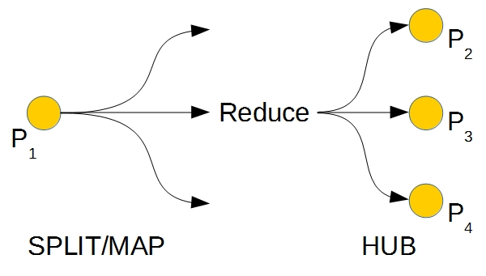
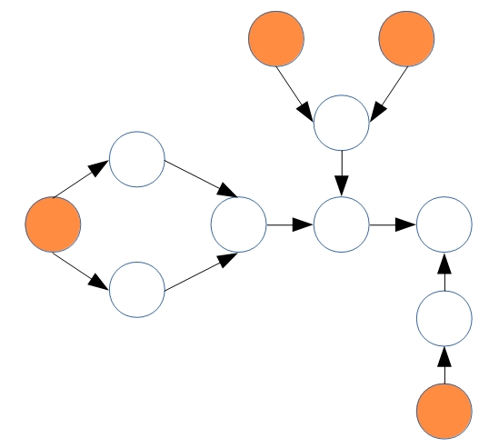
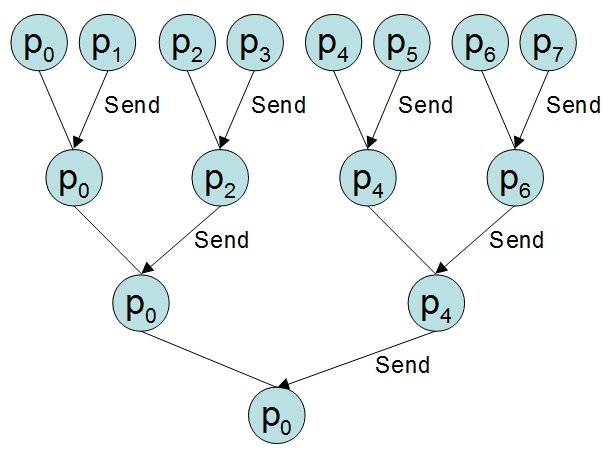

[](https://travis-ci.org/relvaner/nodes4j-core)
[](https://coveralls.io/github/relvaner/nodes4j-core?branch=master)
[](https://www.apache.org/licenses/)

## Actor4j - Streams (formerly known as Nodes4j) ##

At `nodes4j`, nodes correspond to the processes, following the process algebra [[1](#1)]. Several processes can be executed both sequentially and in parallel. Figure 1 shows the general workflow of a process. The incoming data of process P1 is first split evenly and then mapped accordingly. Then, the results are merged (Reduce) and sent to P2, P3, and P4 (Hub) processes. The `MapReduce` process is executed in parallel. The advantage of this approach lies in the loose coupling of the nodes or processes. They can be easily exchanged and replaced by others.



Fig. 1: Schematic representation of the workflow of `nodes4j`

It is a linear pipeline if several processes are connected sequentially at `nodes4j`. When arranged in parallel around a concurrent pipeline (nonlinear pipeline [[2](#2)]), the process could be optimized by vertical scaling if appropriate hardware is available. This means that the corresponding pipeline layout would need to be duplicated repeatedly in order to scale it vertically. The processes can be arranged to a directional acyclic graph (Figure 2).



Fig. 2: Directional acyclic graph (DAG)

## Implementation ##

The core components of `nodes4j` are `Process`, `NodeActor`, and `TaskActor`. A process instantiates a `NodeActor` at startup. The `NodeActor` is the receiving point of the data to be processed. `TaskActors` then process the data in parallel. `Process` provides a variety of operations to apply to the data.

### NodeActor ###

If child nodes are present, they are initialized accordingly and automatically create the structure of a directed graph. 
- Upon receipt of the `DATA` message, the list of data is evenly distributed to the newly generated `TaskActors` for parallel processing. 
- If the `NodeActor` is at the graph's final endpoint, the processing result is stored under its current `UUID` or alias. 
- When all final endpoints of the graph have completed their calculations, the `ActorSystem` is currently automatically shut down.

### TaskActor ###

- First, the registered node operations (filtering, mapping, etc.) are performed on the partial data.
- In the second step, the reduce operation is initiated, which may include a binary operation (e.g., new result of p0 x p1 -> p0*). See the lower tree-like communication structure during the reduce operation of the participating `TaskActors`. The communication is asynchronous. The structure of the merge process (see Figure 3) enables an optimal load distribution to the involved `TaskActors`.
- The result may be passed on to successor nodes.



Fig. 3: Representation of the tree-like communication structure during the reduction process

## Internal DSL ##

```java
process1
    // intra-process operation
    .data(...)
    .filter(...)
    .map(...)
    .forEach(...)
    .reduce(…)
    
    // or
    .data(...)
    .flatMap(...)
    .reduce(…)
    
    // or with Java Stream API
    .data(...)
    .stream(s -> s.filter(...).map(...))
    .reduce(…)
    
    // or with RxJava 3
    .data(...)
    .streamRx(o -> o.filter(...).map(...))
    .reduce(…)
    
    // sorting as inter-process operation
    .sortedASC() or .sortedDESC()

    // inter-process operation
    .sequence(process2, process3.parallel(process5, process6, process7));
        
process8.merge(process6, process7);
```
## Example ##

```java
Process<Integer, Integer> process_main = new Process<>("process_main");
process_main
	.data(List.of(14, 31, 34, 45, 78, 99, 123, 9257));
		
Process<Integer, Integer> process_a = new Process<>("process_a");
process_a
	.filter((v) -> v>50 && v<100)
	.map((v) -> v+2);
Process<Integer, Integer> process_b = new Process<>("process_b");
process_b
	.filter((v) -> v>0 && v<=50)
	.map((v) -> v+1);
Process<Integer, Integer> process_sort_asc = new SortProcess<Integer>("process_sort_asc",
	SortType.SORT_ASCENDING);		
		
process_main.parallel(process_a, process_b);
process_sort_asc.merge(process_a, process_b);
		
ProcessManager manager = new ProcessManager(true);
manager
	.onTermination(() -> { 
		logger().debug("Data (process_a): "+manager.getData("process_a")); 
		logger().debug("Data (process_a): "+process_a.getData()); 
		logger().debug("Data (process_b): "+manager.getData("process_b")); 
		logger().debug("Data (process_sort_asc): "+manager.getData("process_sort_asc")); 
		logger().debug("Result (process_sort_asc): "+manager.getResult("process_sort_asc")); 
	})
	.start(process_main);
```

## References ##
[1]<a name="1"/> Baeten, J.C.M., Basten, T. & Reniers, M.A (2009). Process Algebra. Equational Theories of Communicating Processes. Volume 50. Cambridge University Press.  
[2]<a name="2"/> Mattson, Timothy G., Snaders, Beverly A. & Massingill, Berna L. (2004). A Pattern Language for Parallel Programming. Addison Wesley. http://www.cise.ufl.edu/research/ParallelPatterns/PatternLanguage/AlgorithmStructure/Pipeline.htm  

Last updated 06/07/2024